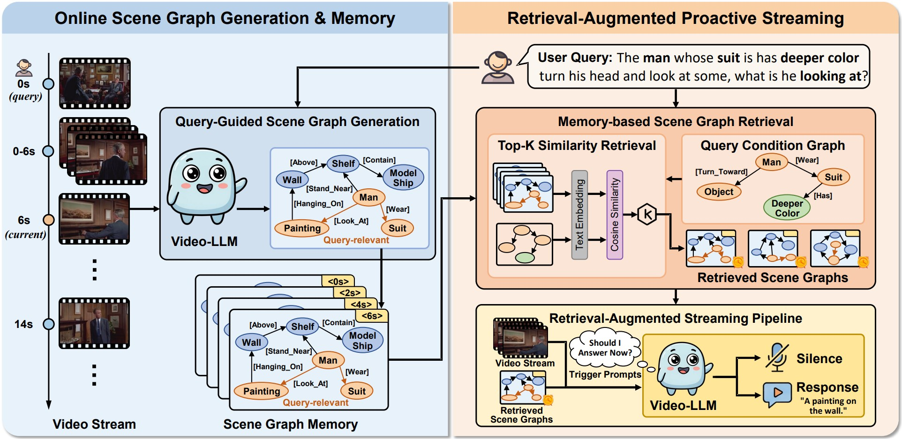

# Response-G1: Explicit Scene Graph Modeling for Proactive Streaming Video Understanding

[](https://www.python.org/downloads/)
[](https://2026.aclweb.org/)

📄 **ACL 2026** · [Paper (PDF)](https://arxiv.org/abs/2605.07575)

[📖 Overview](#-overview) · [📌 Updates](#-updates) · [🔧 Installation](#-installation) · [💾 Data and Model](#-data-and-model) · [🚀 Usage](#-usage) · [📚 Citation](#-citation) · [🙏 Acknowledgements](#-acknowledgements) · [📬 Contact](#-contact)

---

## 📖 Overview

**Response-G1** is a **fine-tuning-free** framework for **streaming video understanding (SVU)**. It asks Video-LLMs to decide **when** to speak while video unfolds (**proactive** timing) and to answer under streaming constraints, without relying only on implicit visual evidence.

The key idea is to **align accumulated video evidence with query-specific response conditions** using a shared **scene graph** representation:

1. **Online Query-Guided Scene Graph Generation** — from streaming clips, extract scene graphs that reflect what is visible and what matters for the query.
2. **Memory-Based Graph Retrieval** — keep a bank of historical graphs and retrieve the most **semantically relevant** graphs.
3. **Retrieval-Augmented Trigger** — inject retrieved graphs (with light temporal cues) into the Video-LLM for **silence / respond** decisions and downstream answers.

Grounding both **evidence** and **conditions** in graphs yields **more interpretable** and **more accurate** response timing, as reported on standard SVU benchmarks (see the paper for full results).

<div align="center">

</div>

---

## 📌 Updates

- ✅ **April 6, 2026** — Response-G1 accepted to **ACL 2026**.  
- ✅ **May 26, 2026** — Official evaluation code released in this repository.

---

## 🔧 Installation

We recommend **Python 3.10+** and a **CUDA** environment suitable for [**Qwen3-VL**](https://github.com/QwenLM/Qwen3-VL).

```bash
# Example: create a conda env and install core deps
conda create -n response-g1 python=3.10 -y
conda activate response-g1
pip install -r requirements.txt
```

---

## 💾 Data and Model

This repo’s scripts expect **benchmark-specific** assets:

| Benchmark | Role in this repo | Typical layout |
|-----------|-------------------|------------------|
| [**StreamingBench**](https://streamingbench.github.io/) | Proactive / reactive streaming QA | Task CSVs + per-sample `video.mp4` under a root folder |
| [**OVO-Bench**](https://github.com/JoeLeelyf/OVO-Bench) | Streaming video understanding (e.g., CRR proactive, mixed reactive tasks) | `ovo_bench_new.json` + `src_videos/` |

Download the benchmarks from their official releases, then pass **all paths on the command line** (there are no machine-specific path globals in the runners):

- **`--ckpt_path`** — local Hugging Face–style folder for [**Qwen3-VL**](https://huggingface.co/Qwen/Qwen3-VL-8B-Instruct) weights
- **`--task_csv`** — StreamingBench annotation CSV (reactive / proactive scripts)
- **`--task_json`** or **`--task_csv`** — same path to **`ovo_bench_new.json`** for OVO-Bench scripts (`--task_csv` is kept as an alias only)
- **`--video_dir`** — root directory of benchmark videos  
- **`--result_dir`** — run root: each job writes `log/`, `output/*.jsonl`, and `drop/` under this directory

---

## 🚀 Usage

Export `CUDA_VISIBLE_DEVICES` before launch to pick a GPU. If it is unset, each runner defaults it to `0` (see the top of the `eval_*.py` scripts).

### StreamingBench — proactive (PO)

```bash
python eval_streamingbench_proactive.py \
  --ckpt_path /path/to/Qwen3-VL-8B-Instruct \
  --task_csv /path/to/Proactive_Output.csv \
  --video_dir /path/to/StreamingBench_PO \
  --result_dir ./runs/streamingbench_proactive
```

Common optional flags: `--run_name`, `--fps`, `--frame_interval`, `--tolerance_time`, `--sg_generation_interval`, `--sg_force_first_frame` / `--no-sg_force_first_frame`, `--min_pixels` / `--max_pixels`, `--min_frames` / `--max_frames`. Run `python eval_streamingbench_proactive.py --help` for the full list.

### StreamingBench — reactive

```bash
python eval_streamingbench_reactive.py \
  --ckpt_path /path/to/Qwen3-VL-8B-Instruct \
  --task_csv /path/to/Real_Time_Visual_Understanding.csv \
  --video_dir /path/to/StreamingBench_videos \
  --result_dir ./runs/streamingbench_reactive
```

### OVO-Bench — proactive (CRR)

```bash
python eval_ovobench_proactive.py \
  --ckpt_path /path/to/Qwen3-VL-8B-Instruct \
  --task_json /path/to/ovo_bench_new.json \
  --video_dir /path/to/OVO-Bench/src_videos \
  --result_dir ./runs/ovobench_proactive
```

(`--task_csv` is accepted as an alias for `--task_json`.) Other knobs (pixels, frames, scene-graph switches) are listed in `python eval_ovobench_proactive.py --help`.

### OVO-Bench — reactive

```bash
python eval_ovobench_reactive.py \
  --ckpt_path /path/to/Qwen3-VL-8B-Instruct \
  --task_json /path/to/ovo_bench_new.json \
  --video_dir /path/to/OVO-Bench/src_videos \
  --result_dir ./runs/ovobench_reactive
```

### Post-hoc evaluation

```bash
python eval_streaming_results.py --result_file ./runs/.../your_run.jsonl --output_file ./runs/.../metrics.json
python eval_ovo_results.py --result_file ./runs/.../your_run.jsonl
```

---

## 📚 Citation

If you find this work useful, please cite:

```bibtex
@inproceedings{ma2026responseg1,
  title     = {{Response-G1}: Explicit Scene Graph Modeling for Proactive Streaming Video Understanding},
  author    = {Ma, Ke and Tang, Jiaqi and Guo, Bin and Han, Xueting and Xu, Ruonan and He, Qingfeng and Wang, Ziheng and Wang, Xu and Chen, Qifeng and Yu, Zhiwen and Liu, Yunhao},
  booktitle = {Proceedings of the Association for Computational Linguistics},
  year      = {2026}
}
```

---

## 🙏 Acknowledgements

This repo is built upon:

- [TimeChat-Online](https://timechat-online.github.io/)
- [StreamingBench](https://streamingbench.github.io/)
- [OVO-Bench](https://github.com/JoeLeelyf/OVO-Bench)

We sincerely thank the authors for the open-source work.

---

## 📬 Contact

If you encounter any problems or have questions, feel free to reach out:

📧 2544552413@mail.nwpu.edu.cn